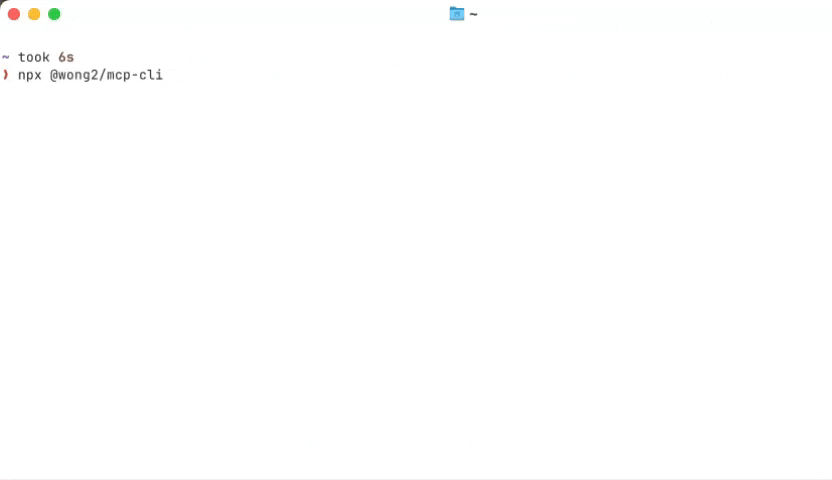

# mcp-cli

A CLI inspector for the Model Context Protocol



## Usage

### Run without config file

```bash
npx @wong2/mcp-cli
```

This will use the config file of Claude Desktop.

### Run with a config file

```bash
npx @wong2/mcp-cli -c config.json
```

The config file has the same format as the Claude Desktop config file.

### Run servers from NPM

```bash
npx @wong2/mcp-cli npx <package-name> <args>
```

### Run locally developed server

```bash
npx @wong2/mcp-cli node path/to/server/index.js args...
```

### Connect to a running server over SSE

```bash
npx @wong2/mcp-cli --sse http://localhost:8000/sse
```

You need to first start an MCP server running over [SSE transport](https://modelcontextprotocol.io/docs/concepts/transports#server-sent-events-sse).

## Features

- Run MCP servers from various sources
- List Tools, Resources, Prompts
- Call Tools, Read Resources, Read Prompts

## Related

- [LiteMCP](https://github.com/wong2/litemcp) - A TypeScript library that simplifies MCP server development
- [mcpservers.org](https://mcpservers.org) - A curated list of MCP servers
